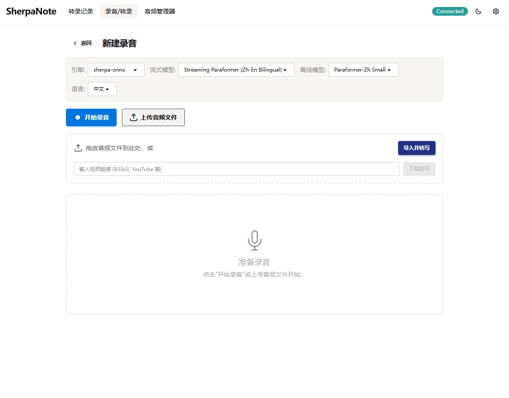

# SherpaNote - AI驱动的语音学习助手



[English README](README.md)

SherpaNote 是一款智能语音学习助手，结合了实时语音识别与AI驱动的文本处理功能。录制您的想法、讲座或对话，让 SherpaNote 自动转录并利用AI润色、笔记整理、思维导图和头脑风暴等功能来增强您的内容。

基于 **PyWebVue** 框架构建，SherpaNote 在 Windows 和 macOS 上提供无缝的桌面体验，同时利用现代 Web 技术为用户界面提供强大支持。

## 功能特性

### 语音识别
- **实时流式转录**：基于 Zipformer/Paraformer 在线模型的实时部分结果显示
- **离线音频文件转录**：基于 VAD 的语音分段切割与进度追踪
- **模拟流式识别**：VAD + 离线模型管线，为仅支持离线的模型（SenseVoice、Qwen3-ASR、Cohere Transcribe）提供实时显示能力
- **GPU 加速**：自动检测 NVIDIA CUDA 设备，显著提升大模型（Qwen3-ASR、Whisper）的转录速度
- **Whisper.cpp 集成**：可选的 ASR 后端，提供更好的模型支持和更多硬件兼容性
- **多语言支持**：14 种语言，包括中文、英文、日文、韩文、粤语等
- **10+ ASR 模型**：来自多个提供商（Paraformer、SenseVoice、Whisper、Qwen3-ASR、FunASR Nano、Cohere Transcribe）
- **自动模型类型检测**：基于文件启发式规则的流式/离线/模拟流式分类，支持用户自行下载的模型
- **可配置 VAD**：可调节的语音活动检测参数（阈值、静音/语音时长、最大语音时长）
- **macOS 音频兼容**：AudioContext 重采样、静音检测与用户警告、重试逻辑

### AI 处理
- **文本润色**：优化和改进转录文本
- **智能笔记**：将原始转录转换为结构化笔记
- **思维导图**：从内容生成可视化思维导图（Markmap/Mermaid 格式）
- **头脑风暴**：通过 AI 生成建议扩展思路
- **流式响应**：实时 AI 令牌流式传输，支持截断检测和"继续输出"恢复
- **自定义 AI 预设**：用户自定义处理模板，支持自定义提示词
- **多供应商 API 管理**：配置多个 AI 供应商（OpenAI 兼容、OpenRouter），支持连接测试
- **转录后自动 AI 处理**：转录完成后自动执行选定的 AI 处理模式

### 数据管理
- **持久化存储**：所有记录通过 SQLite 数据库（WAL 模式）本地保存
- **版本历史**：手动版本快照，支持恢复、内容差异脏检测和可配置的保留上限
- **音频管理**：专用音频文件管理视图，重新转录，灵活的录制/导入工作流
- **搜索功能**：通过标题或转录文本中的关键词查找记录
- **导入/导出**：支持 Markdown、TXT、DOCX 和 SRT 格式

### OCR 图像识别
- **多后端提取**：智能决策树将文件路由到最优后端
- **图片文字识别**：使用 PP-OCR (RapidOCR) 从图片中提取文字
- **PDF 文本层检测**：自动检测文本层 PDF，使用 markitdown 直接提取文字
- **Office 文档支持**：通过 markitdown 提取 DOCX、PPTX 和 XLSX 文件的文字
- **扫描件 PDF 处理**：非文本 PDF 转换为图片 (pypdfium2) 后进行 OCR 识别
- **插件后端**：可选高级引擎（docling、opendataloader-pdf）可从设置页安装
- **全屏拖拽**：全窗口文件拖放区域，实时显示 PDF 文本层状态
- **多种处理模式**：批处理模式（每个文件生成独立记录）和顺序处理模式（合并为单条记录）
- **灵活的模型选择**：支持 PP-OCRv4 和 PP-OCRv5 模型，每个组件（检测/识别/分类）可独立选择 Mobile/Server 版本
- **内置模型管理**：通过 RapidOCR 自动下载、缓存和生命周期管理模型
- **实时进度显示**：拖拽上传文件，实时显示处理进度
- **离线打包**：支持在打包时预下载 OCR 模型，供离线使用

### 模型管理
- **多源下载**：GitHub、HuggingFace、HF-Mirror、GitHub Proxy 和魔搭社区
- **代理支持**：不使用代理 / 系统代理 / 自定义代理
- **模型目录**：10+ 精选 ASR 模型，标注大小、语言和下载源可用性
- **一键安装**：直接从应用内下载、安装、验证模型
- **自定义模型支持**：放入模型目录的任何 sherpa-onnx 兼容模型都会被自动检测
- **相关链接**：快速访问模型源、字幕生成工具和文档

### 插件系统
- **运行时隔离**：插件在捆绑的 Python 子进程中通过 uv 执行，与宿主完全隔离
- **文档提取插件**：可选高级引擎（docling 搭配 RapidOCR、opendataloader-pdf 搭配 Java）
- **设置界面**：引擎切换、后端管理、环境配置、Java 路径检测
- **生命周期管理**：一键安装/卸载，带进度日志和状态反馈
- **自动配置**：Docling 默认使用 RapidOCR 后端，复用已有 OCR 模型

### 用户体验
- **Notion 风格设计**：基于 Vue 3 + DaisyUI 5 + Tailwind CSS 4 的简洁现代界面
- **深色/浅色模式**：自动主题切换，支持系统偏好检测
- **中文界面**：完整的中文本地化
- **可折叠面板**：转录文本和音频播放器区域可折叠以获得更多工作空间
- **原生文件对话框**：通过 pywebview 实现平台原生的文件和文件夹选择器

## 技术栈

### 后端 (Python)
- **Python 3.10+**：核心应用逻辑
- **sherpa-onnx**：本地优先的语音识别引擎（Paraformer、SenseVoice、Whisper、Qwen3-ASR、FunASR Nano、Cohere Transcribe）
- **RapidOCR**：本地 OCR 引擎，支持 PP-OCRv4/v5 模型（检测/识别/分类组件独立配置）
- **markitdown**：文本层 PDF 和 Office 文档 (DOCX/PPTX/XLSX) 提取
- **pypdfium2**：PDF 转图片渲染（BSD 许可证）
- **pdfplumber**：PDF 文本层检测
- **OpenAI 兼容 API**：AI 文本处理和生成（支持 OpenRouter 和自定义端点）
- **pywebview**：原生桌面窗口管理（通过 PyWebVue 框架）
- **SQLite（WAL 模式）**：带原子事务的本地数据持久化
- **uv**：快速的 Python 包管理和执行工具

### 前端 (Vue.js)
- **Vue 3**：响应式用户界面框架
- **TypeScript**：类型安全的 JavaScript 开发
- **Vite**：极速开发服务器和构建工具
- **Tailwind CSS 4**：实用优先的 CSS 框架
- **DaisyUI 5**：带有内置主题的美观组件库
- **Pinia**：Vue 应用程序的状态管理
- **Web Audio API**：基于浏览器的音频采集，PCM 流式传输至后端

### 构建与部署
- **PyInstaller**：桌面应用程序打包（onedir/onefile）
- **跨平台**：单一代码库支持 Windows 和 macOS
- **CUDA 构建**：通过 `--cuda` 标志构建可选的 GPU 加速版本
- **bun**：前端包管理

## 快速开始

### 先决条件
- **Python 3.10 或更高版本**
- **uv** 包管理器：[安装 uv](https://docs.astral.sh/uv/getting-started/installation/)
- **bun** 用于前端依赖

### 安装
```bash
# 克隆仓库
git clone https://github.com/wish2333/sherpanote.git
cd sherpanote

# 安装依赖并启动开发服务器
uv run dev.py
```

### 开发命令
```bash
# 启动开发环境（Vite + Python 应用）
uv run dev.py

# 仅安装依赖（不启动应用）
uv run dev.py --setup

# 从构建的前端加载（生产预览）
uv run dev.py --no-vite
```

## 构建与打包

### 桌面应用程序
```bash
# 构建目录型应用程序（推荐）
uv run build.py

# 构建单个可执行文件
uv run build.py --onefile

# 构建时捆绑ASR模型（仅目录模式）
uv run build.py --with-models sherpa-onnx-paraformer-zh-small-2024-03-09

# 构建时预下载OCR模型以供离线使用（仅目录模式）
uv run build.py --with-ocr-models

# 构建时捆绑插件运行时（python-build-standalone + uv，仅目录模式）
# 启用可选后端：docling、opendataloader-pdf
uv run build.py --with-plugins

# 构建 CUDA GPU 加速版本（NVIDIA，需要 CUDA 工具包 + cuDNN）
uv run build.py --cuda
uv run build.py --cuda --cuda-variant cuda12.cudnn9  # CUDA 12.x + cuDNN 9

# 清理构建产物
uv run build.py --clean
```

## 使用指南

### 录制音频
1. 点击主界面中的**录制**按钮
2. 自然说话 - 您将看到实时转录更新
3. 完成后点击**停止**
4. 您的录音将自动保存，包含音频文件和转录文本

### AI 处理
1. 从列表中选择任意记录
2. 选择 AI 模式：**润色**、**笔记**、**思维导图**或**头脑风暴**
3. 点击**处理**以增强您的内容
4. 实时查看 AI 令牌流式传输的结果

### 管理模型
1. 进入**设置** > **模型设置**进行活跃模型选择和 VAD 参数配置
2. 进入**设置** > **模型管理**浏览、下载和安装模型
3. 模型会自动分类为流式/离线，并出现在对应的下拉框中

### 导入与导出
- **导入**：拖拽音频文件，或使用导入按钮将文件复制到管理的音频目录中
- **导出**：使用编辑器视图中的导出菜单（MD、TXT、DOCX、SRT 格式）

## 项目结构

```
sherpanote/
├── frontend/           # Vue.js 前端应用程序
│   ├── src/
│   │   ├── components/ # 可复用 UI 组件
│   │   │   ├── AiProcessor.vue       # AI 处理控制面板
│   │   │   ├── AudioRecorder.vue     # 麦克风录制（含静音检测）
│   │   │   ├── ExportMenu.vue        # 多格式导出下拉菜单
│   │   │   ├── RecordCard.vue        # 记录列表项
│   │   │   ├── SearchBar.vue         # 关键词搜索和筛选
│   │   │   ├── TranscriptPanel.vue   # 转录文本显示和编辑
│   │   │   ├── VersionHistory.vue    # 版本列表（恢复/删除）
│   │   │   ├── MindMapPreview.vue    # Mermaid 思维导图渲染
│   │   │   ├── MarkdownRenderer.vue  # Markdown 内容渲染
│   │   │   └── ThemeToggle.vue       # 深色/浅色模式切换
│   │   ├── views/
│   │   │   ├── HomeView.vue          # 记录列表（搜索/筛选）
│   │   │   ├── RecordView.vue        # 录音和文件转录
│   │   │   ├── EditorView.vue        # 转录编辑 + AI 处理
│   │   │   ├── OcrView.vue           # OCR 图像识别（全屏拖拽、批处理/顺序处理）
│   │   │   ├── SettingsView.vue      # 完整设置（通用、模型、AI、ASR、OCR、文档 选项卡）
│   │   │   └── AudioManageView.vue   # 音频文件管理
│   │   │   └── AudioManageView.vue   # 音频文件管理
│   │   ├── composables/
│   │   │   ├── useRecording.ts       # 音频采集、重采样、静音检测
│   │   │   ├── useTranscript.ts      # 转录事件处理
│   │   │   ├── useAiProcess.ts       # AI 流式传输和结果管理
│   │   │   ├── usePlugin.ts          # 插件安装/卸载生命周期管理
│   │   │   └── useStorage.ts         # CRUD 操作和版本控制
│   │   ├── stores/
│   │   │   └── appStore.ts           # 全局状态（配置、模型、设置）
│   │   ├── bridge.ts                 # PyWebVue 桥接：call()、onEvent()
│   │   └── types.ts                  # TypeScript 类型定义
│   └── index.html
├── py/                 # Python 后端模块
│   ├── asr.py                 # ASR 引擎（流式/离线/模拟流式）
│   ├── llm.py                 # AI 文本处理（流式）
│   ├── config.py              # 应用配置管理
│   ├── storage.py             # SQLite 持久化 + 版本控制
│   ├── model_manager.py       # 模型下载、安装、验证（5 种源）
│   ├── model_registry.py      # 模型目录（10+ 模型）
│   ├── presets.py             # AI API 预设管理
│   ├── processing_presets.py  # AI 处理模板管理
│   ├── gpu_detect.py          # NVIDIA CUDA 检测与验证
│   ├── ocr.py                 # OCR 引擎（RapidOCR 封装、PDF 转换）
│   ├── document_extractor.py  # 文档提取决策树
│   ├── text_detector.py       # 文件分类 + PDF 文本层检测
│   ├── adapters/              # 后端适配器（ppocr、markitdown）
│   ├── outputs/               # 统一输出类型（ExtractedDocument）
│   ├── plugins/               # 插件系统
│   │   └── runners/           # 插件运行器（docling、opendataloader）
│   ├── whispercpp.py          # Whisper.cpp ASR 后端集成
│   ├── video_downloader.py    # 视频下载转录
│   └── io.py                  # 音频 I/O 工具
├── pywebvue/           # PyWebVue 框架核心
├── main.py             # 应用程序入口 + Bridge API
├── dev.py              # 开发启动脚本
├── build.py            # 构建和打包脚本
└── app.spec            # PyInstaller 配置
```

## 配置

SherpaNote 使用存储在 SQLite 中的持久化配置系统。关键配置选项包括：

- **通用**：数据目录、最大版本历史数、自动标点、转录后自动 AI 处理
- **模型设置**：活跃流式/离线模型、语言、GPU 开关、VAD 参数（阈值、静音/语音时长）
- **AI 设置**：API 预设（名称、Base URL、密钥、模型）、处理预设（名称、模式、提示词模板）、温度、最大令牌数、自动最大令牌数
- **模型管理**：下载源、代理设置、模型目录

配置可以通过**设置**界面修改。

## 更新日志

完整更新日志请查看 [docs/changelog.md](docs/changelog.md)。

[2026-04-30 - v2.1.0 插件系统与 OCR 升级]

### 新增
- 全新的插件运行时架构：通过 uv 子进程隔离执行，支持按需安装高级文档提取引擎
- 新增 docling 插件：高级布局分析 + OCR，默认使用 RapidOCR 后端复用已有模型
- 新增 opendataloader-pdf 插件：基于 Java 的 PDF 提取（需 Java 17+ 运行时）
- 新增文档设置面板：PDF 处理模式选择、后端安装/卸载、Java 环境自动检测
- 新增 PyPI 和 HuggingFace 镜像源配置，支持插件安装和模型下载加速
- OCR 页全屏拖拽布局，文件列表自动检测 PDF 文字层状态
- 新增 usePlugin composable 封装插件安装/卸载生命周期
- Docling 支持手动预下载模型，可配置模型存储目录
- 上传文件格式前端校验与错误提示
- 引擎不可用时自动回退并弹出警告提示
- 支持 30+ 音频和视频文件格式的 AI 处理（通过 FFmpeg）

### 修复
- 修复切换 PDF 引擎后不生效的问题
- 修复插件安装/卸载时无日志输出、安装进度无响应的问题
- 修复自定义 Java 路径未实际生效的问题
- 修复 opendataloader-pdf 处理后输出空白内容的问题
- 修复设置页环境配置文字溢出容器的问题
- 修复 OCR 页引擎选择未在启动时同步已保存配置的问题
- 修复插件安装完成后引擎选项仍显示未安装的问题
- 修复导出备份默认勾选应用配置的问题
- 修复拖拽上传区域无法铺满全屏的问题
- 修复打包后打开首页可能一直显示加载动画的问题
- 修复历史记录列表中 AI 处理状态标记偶尔消失的问题
- 修复模型名空格导致模型调用失败的问题
- 修复模型目录配置异常导致找不到本地模型的问题
- 修复 MAC 端导入 PDF 时 pypdfium2 导致的段错误

### 优化
- 插件与文档配置修改后自动保存，无需手动点击保存
- opendataloader-pdf 临时文件处理完毕后自动清理
- 扫描件 PDF 自动跳过 opendataloader，直接使用 OCR 引擎
- 大幅提升历史记录列表的加载速度，记录越多提速越明显

[2026-04-22 - OCR 功能修复]

### 新增
- OCR 识别记录自动添加“OCR-”前缀，统一单文件、PDF 及多文件批处理的命名规则，方便快速区分与检索（自定义标题功能保持不变）

### 修复
- 修复 OCR 界面点击添加按钮无响应的问题
- 修复 ASR 设置中通过浏览按钮切换模型目录后，需要重新进入页面才生效的问题

[2026-04-20 - OCR 图像识别功能上线]

### 新增
- 全新的 OCR 图像识别功能：支持图片、多图和 PDF 文件的文字识别
- 新增 OCR 专用视图界面，拖拽上传文件，实时显示处理进度
- OCR 设置页面，可灵活选择不同版本的模型（v4/v5）和类型（移动版/服务器版）
- 支持两种处理模式：批处理（每图生成独立记录）和顺序处理（合并为单记录）
- 内置模型管理：通过 RapidOCR 自动下载、缓存和生命周期管理模型
- 支持在打包时预下载 OCR 模型，供离线使用

### 修复
- 修复 OCR 模型选择和结果解析错误
- 解决模型下载和管理问题
- 修复前端设置界面显示不完整的问题

### 优化
- 重构 OCR 模型管理系统，改为使用 RapidOCR 内置的自动下载和管理
- 打包优化：添加预下载 OCR 模型选项，提升离线使用体验
- 精简 OCR 设置选项，移除不必要的参数配置

## 贡献指南

我们欢迎贡献！以下是参与步骤：

1. **Fork** 仓库
2. **创建**功能分支 (`git checkout -b feature/amazing-feature`)
3. **提交**您的更改 (`git commit -m '添加神奇功能'`)
4. **推送**到分支 (`git push origin feature/amazing-feature`)
5. **打开**拉取请求

### 开发准则
- 遵循现有的代码风格和模式
- 编写有意义的提交消息（conventional commits 格式）
- 确保跨平台兼容性（Windows + macOS）
- 为新功能更新文档

### 报告问题
报告 bug 或请求功能时，请包含：
- 您的操作系统及版本
- Python 版本
- 复现问题的步骤
- 期望行为 vs 实际行为
- 任何错误消息或日志

## 许可证

本项目采用 MIT 许可证 - 详情请参阅 [LICENSE](LICENSE) 文件。

## 致谢

- **[sherpa-onnx](https://github.com/k2-fsa/sherpa-onnx)**：新一代语音识别工具包
- **[RapidOCR](https://github.com/RapidAI/RapidOCR)**：出色的OCR识别工具包
- **[markitdown](https://github.com/microsoft/markitdown)**：将文件转换为 Markdown
- **[docling](https://github.com/docling-project/docling)**：高级文档提取与布局分析
- **[pywebview](https://github.com/r0x0r/pywebview)**：跨平台原生 GUI 库
- **[PyWebVue](https://github.com/nicepkg/pywebvue)**：Vue + pywebview 桌面应用框架
- **[Vue.js](https://vuejs.org/)**：渐进式 JavaScript 框架
- **[Tailwind CSS](https://tailwindcss.com/)**：实用优先的 CSS 框架
- **[DaisyUI](https://daisyui.com/)**：Tailwind CSS 组件库
- **[Hugging Face](https://huggingface.co/)**：开源模型托管平台
- **[魔搭社区](https://www.modelscope.cn/)**：阿里巴巴模型社区
