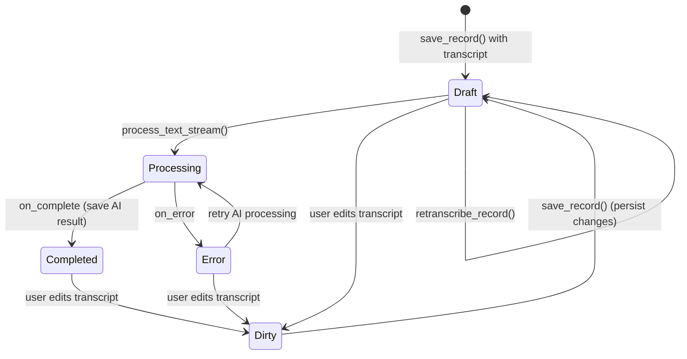
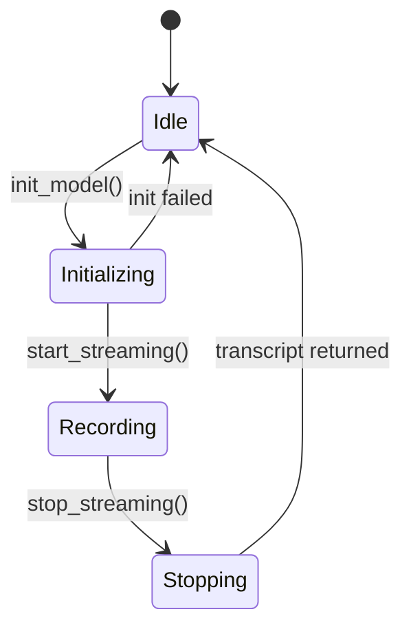
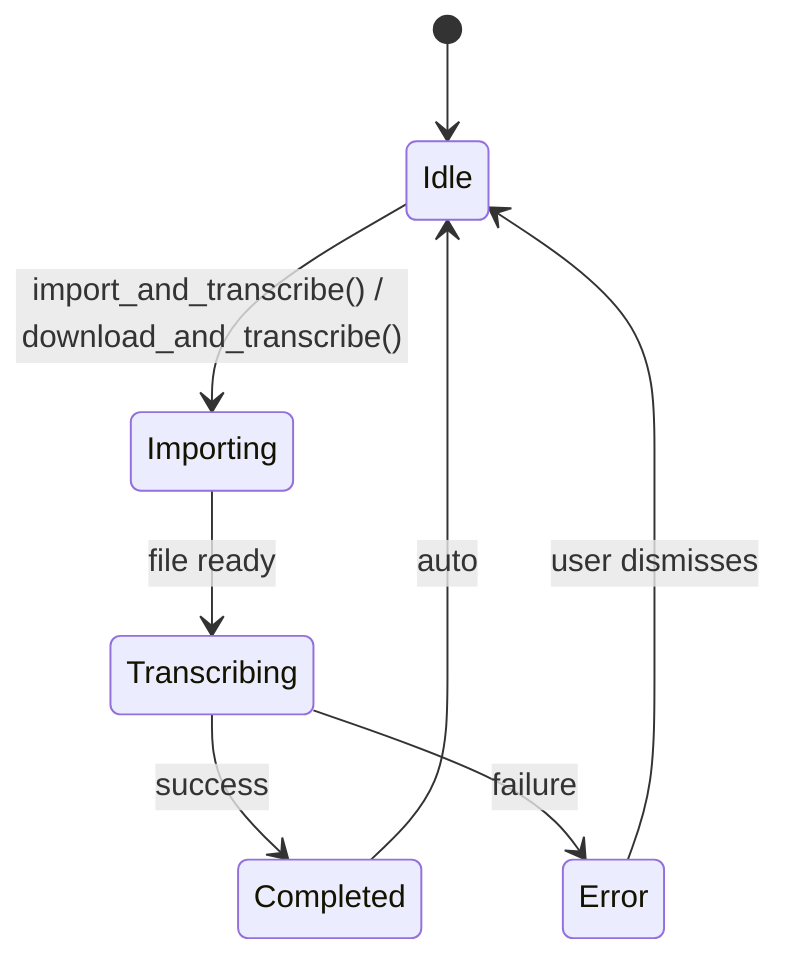
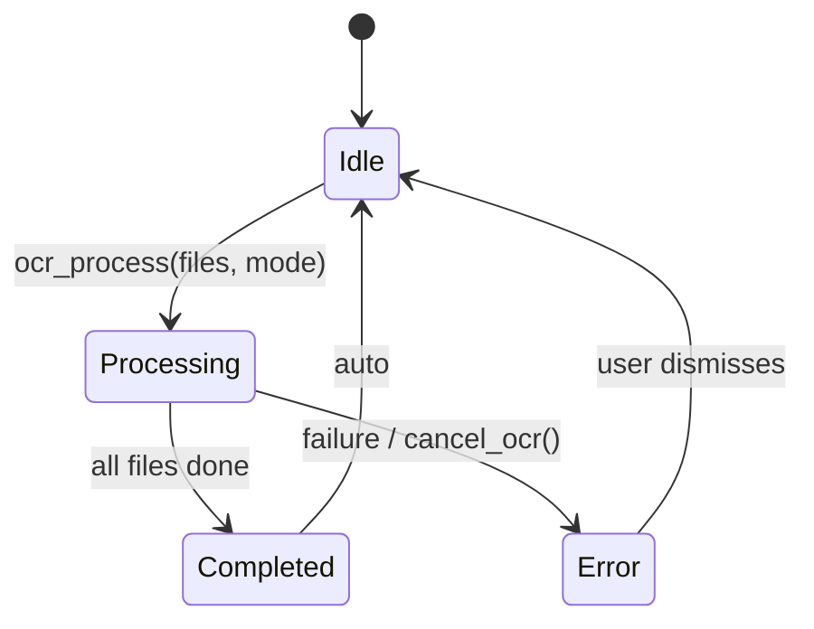
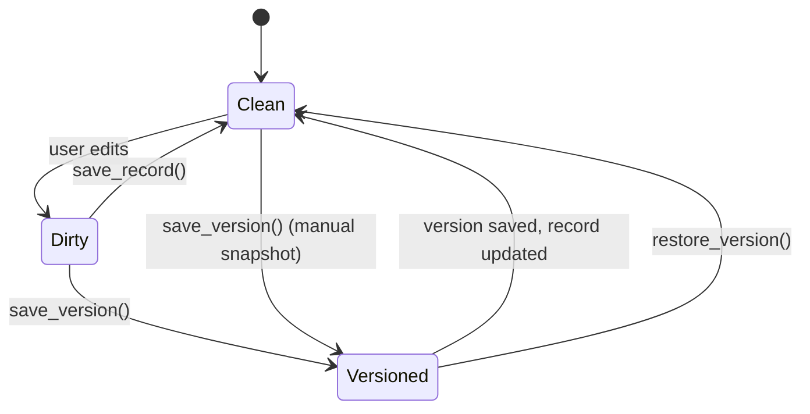

# State Machine Definitions

> Define all entity state machines for the SherpaNote system.
> Each state machine includes states, transitions, and triggers.

---

## Record State Machine

### States

| State | Description | Terminal |
|-------|-------------|----------|
| `draft` | Record created with transcript, not yet AI-processed | No |
| `processing` | AI processing in progress | No |
| `completed` | AI processing completed, result saved | No |
| `error` | AI processing failed | No |
| `dirty` | User has unsaved edits | No |

> Note: Records do not have a terminal state. They can always be re-processed, re-transcribed, or edited.

### State Diagram

### Transition Matrix

| From | To | Trigger | Method | Side Effects |
|------|-----|---------|--------|--------------|
| (new) | `draft` | Record saved with transcript | `save_record()` | Creates DB row, assigns ID |
| `draft` | `processing` | User initiates AI process | `process_text_stream()` | Emits streaming tokens |
| `processing` | `completed` | AI finishes successfully | `_persist_ai_result()` | Updates ai_results_json in DB |
| `processing` | `error` | AI fails or cancelled | `cancel_ai()` / error | No DB change |
| `error` | `processing` | User retries AI process | `process_text_stream()` | Same as draft->processing |
| `draft` | `dirty` | User edits transcript text | Frontend edit | `mark_dirty()` called |
| `completed` | `dirty` | User edits any content | Frontend edit | `mark_dirty()` called |
| `dirty` | `draft` | User saves changes | `save_record()` | `mark_clean()`, auto-versioning |
| `draft` | `draft` | User re-transcribes | `retranscribe_record()` | Creates version, updates transcript |

### Invariants

- [ ] Every record must have a non-empty `id` and `created_at`
- [ ] A record can only be in one state at a time (dirty flag + processing status)
- [ ] Version snapshot is only created when `dirty` state transitions back to `draft`

---

## ASR Recording State Machine

### States

| State | Description | Terminal |
|-------|-------------|----------|
| `idle` | No active recording session | No |
| `initializing` | ASR model is loading | No |
| `recording` | Actively capturing and transcribing audio | No |
| `stopping` | Stop requested, finalizing transcript | No |

### State Diagram

### Transition Matrix

| From | To | Trigger | Method | Side Effects |
|------|-----|---------|--------|--------------|
| `idle` | `initializing` | User clicks record / select model | `init_model(language)` | Loads ASR model into memory |
| `initializing` | `recording` | Model loaded successfully | `start_streaming()` | Starts mic capture via Web Audio |
| `initializing` | `idle` | Model load failed | Error handler | Shows error dialog |
| `recording` | `stopping` | User clicks stop | `stop_streaming()` | Stops mic, finalizes transcript |
| `stopping` | `idle` | Transcript finalized | Event emission | Returns transcript to frontend |
| `recording` | `idle` | User cancels / error | Stop + error | Discards partial results |

### Invariants

- [ ] Only one recording session can be active at a time
- [ ] Model must be fully loaded before streaming starts
- [ ] Audio chunks must be fed as base64-encoded PCM data

---

## File Transcription State Machine

### States

| State | Description | Terminal |
|-------|-------------|----------|
| `idle` | No transcription in progress | No |
| `importing` | File being copied to audio directory | No |
| `transcribing` | ASR processing audio file | No |
| `completed` | Transcription done, record saved | Yes |
| `error` | Transcription failed | No |

### State Diagram

### Transition Matrix

| From | To | Trigger | Method | Side Effects |
|------|-----|---------|--------|--------------|
| `idle` | `importing` | User selects file / enters URL | `import_and_transcribe()` | Copies file, deduplicates |
| `importing` | `transcribing` | File copied successfully | `transcribe_file()` | Progress callbacks emitted |
| `importing` | `error` | File not found / duplicate | Error | Shows message |
| `transcribing` | `completed` | Transcription success | `save_record()` | Creates record, auto AI process |
| `transcribing` | `error` | ASR failure | Error handler | Shows error with details |
| `completed` | `idle` | Auto-return | - | Record available in list |

### Invariants

- [ ] Duplicate files are detected and skipped (audio_meta.json check)
- [ ] Audio duration is calculated and stored after successful transcription
- [ ] Auto AI processing only triggers if user has configured an auto-process preset

---

## OCR Processing State Machine

### States

| State | Description | Terminal |
|-------|-------------|----------|
| `idle` | No OCR in progress | No |
| `processing` | OCR running on files | No |
| `completed` | All files processed, records created | Yes |
| `error` | OCR failed or cancelled | No |

### State Diagram

### Transition Matrix

| From | To | Trigger | Method | Side Effects |
|------|-----|---------|--------|--------------|
| `idle` | `processing` | User uploads files and starts OCR | `ocr_process(files, mode, title)` | Progress events emitted |
| `processing` | `completed` | All files processed | Internal | Creates records (batch: 1 per file, single: 1 merged) |
| `processing` | `error` | OCR failure or cancel | `cancel_ocr()` | Partial results discarded |
| `completed` | `idle` | Auto-return | - | Records available in list |
| `error` | `idle` | User dismisses | - | No records created |

### Invariants

- [ ] OCR records are auto-prefixed with "OCR-" unless user provides custom title
- [ ] Batch mode creates one record per file; single mode merges all text
- [ ] Progress events include current/total file count

---

## Version State Machine

### States

| State | Description | Terminal |
|-------|-------------|----------|
| `clean` | Record matches saved version | No |
| `dirty` | Unsaved changes exist | No |
| `versioned` | Version snapshot created | No |

### State Diagram

### Transition Matrix

| From | To | Trigger | Method | Side Effects |
|------|-----|---------|--------|--------------|
| `clean` | `dirty` | User edits transcript/AI results | Frontend | `mark_dirty()` called |
| `dirty` | `clean` | User saves | `save_record()` | Auto-creates version if content changed |
| `clean` | `versioned` | User manually creates version | `save_version()` | Increments version number |
| `versioned` | `clean` | Version save completes | Internal | `mark_clean()` called |
| `versioned` | `dirty` | User edits after versioning | Frontend | New dirty state |

### Invariants

- [ ] Maximum 20 versions per record (oldest pruned first)
- [ ] Version is only created when content actually differs from previous version
- [ ] Version numbers are sequential integers starting from 1
